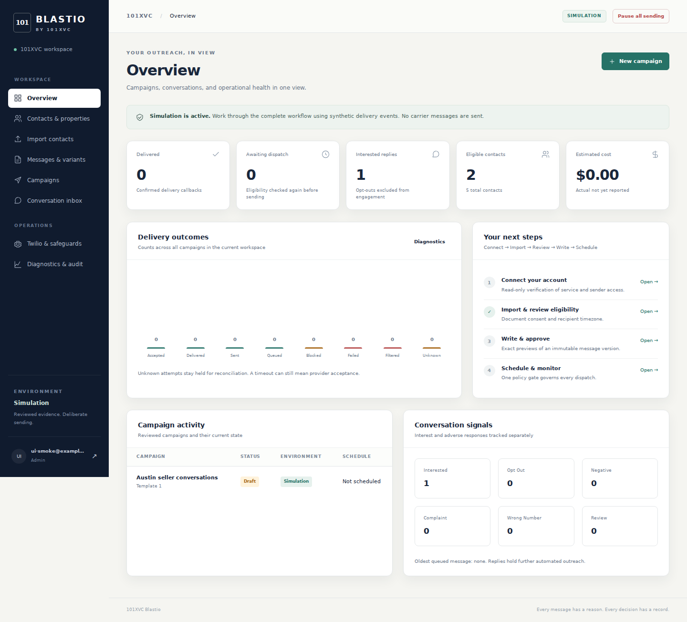

# 101XVC Blastio

Consent-based SMS outreach, seller conversations, and delivery operations using an existing Twilio account. Blastio runs on your own host. It defaults to simulation and never sends a text merely because an account is connected.

This is proprietary 101XVC software. See [LICENSE](LICENSE).



## Start locally

For copy-and-paste Windows setup and the complete operator walkthrough, read [START_HERE.md](START_HERE.md).

Requires Python 3.11 or newer and a modern browser. From the repository root:

```bash
python3 -m venv .venv
source .venv/bin/activate
python -m pip install -r requirements.txt
python -m blastio.cli init --email admin@example.com
python -m blastio.cli demo
uvicorn blastio.app:app --host 127.0.0.1 --port 8000
```

The initialization command prompts for an administrator password. Open http://127.0.0.1:8000 and sign in with that email and password. Start the durable worker in a second terminal, with the same working directory and environment:

```bash
source .venv/bin/activate
python -m blastio.worker
```

The demo uses synthetic records. Imported consent claims remain pending until someone reviews their evidence. Never replace demo phone numbers with real recipients for convenience.

On Windows, use PowerShell:

```powershell
python -m venv .venv
.\.venv\Scripts\Activate.ps1
python -m pip install -r requirements.txt
python -m blastio.cli init --email admin@example.com
python -m blastio.cli demo
uvicorn blastio.app:app --host 127.0.0.1 --port 8000
```

Activate the same virtual environment in another PowerShell window and run `python -m blastio.worker`. Both terminals need the same exported configuration. See [deployment instructions](docs/DEPLOYMENT.md) for Windows environment setup and persistent secrets.

Configuration comes from process environment variables. `.env.example` is a template, not a credentials file to commit. See [deployment instructions](docs/DEPLOYMENT.md) for secret handling and environment setup.

Start imports with [the synthetic sample CSV](examples/import_contacts.csv). CSV supports UTF-8 (including BOM) and BOM-marked UTF-16, with comma, semicolon, tab, or pipe delimiters. National phone formats require an explicit ISO country region; fully specified `+` numbers do not. Imports accept up to 8 MiB and 50,000 rows. Malformed quoting rejects the import; rejected records have row numbers, reasons, and safe downloadable exports. Preview and confirm before committing.

## Operator workflow

Connect → Import → Review eligibility → Write → Preview → Validate → Approve → Schedule → Monitor → Respond.

- **Dashboard:** message outcomes, reply classifications, queue state, costs, and stop controls.
- **Contacts:** normalized phone identities, separate properties, consent evidence, verified timezone, and suppression.
- **Import:** preview CSV mappings, rejected rows, duplicates, and eligibility before committing.
- **Templates and campaigns:** immutable approved versions, rendered previews, reviewed variants, and campaign scheduling.
- **Inbox:** hold automated outreach on replies, assign ownership and lead status, and gate manual replies.
- **Twilio settings:** encrypted credentials, read-only resource verification, registration details, and webhook status.
- **Diagnostics and audit:** delivery errors, unresolved attempts, and operational history.

Multiple properties share a contact identity. Suppression and frequency limits apply across campaigns and business senders. Missing consent, unknown timezone, unapproved content, stale verification, unhealthy webhooks, and stop controls block dispatch with reasons.

## Runtime and verification

FastAPI serves the API and static interface. A separate worker dispatches a durable SQLite queue; WAL and transactions coordinate one host, one API process, and one worker. Run neither a cluster nor multiple worker replicas against this deployment.

```bash
python -m pip install -r requirements-dev.txt
python -m pytest -q
```

Tests use synthetic records and simulated or mocked provider responses. The Twilio REST adapter is implemented, but live account behavior, carrier delivery, and production operations require the [controlled smoke test](docs/SMOKE_TEST.md). No live seller campaign is part of development verification. See [limitations](docs/LIMITATIONS.md) before enabling production.

An ambiguous API outcome is retained as **unknown** and held for reconciliation, never blindly retried. Software cannot guarantee protection from filtering, suspension, carrier enforcement, or duplicate external delivery.

## Read before production

- [Policy and official Twilio sources](docs/POLICY.md)
- [Deployment and existing-account setup](docs/DEPLOYMENT.md)
- [Operating runbook](docs/RUNBOOK.md)
- [Controlled production smoke test](docs/SMOKE_TEST.md)
- [Completed functionality and limits](docs/LIMITATIONS.md)
- [Requirements and test traceability](docs/TRACEABILITY.md)

The default recipient window, frequency caps, rate caps, spending caps, and incident thresholds are configurable internal safeguards. They are not legal advice, universal safe values, or a promise of provider acceptance. A2P registration does not turn an arbitrary list into eligible recipients.
